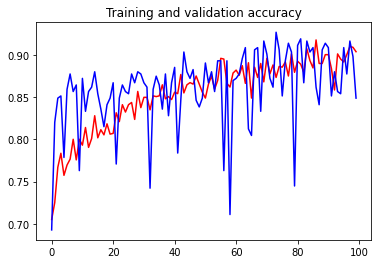
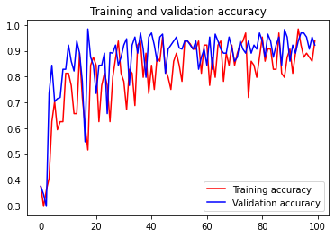

# This repository contains deep learning models worked on unique datasets:

#### The concept of ImageGenerator is used where we do not explicitly label the images but the ImageGenerator will read the images from the subdirectories and automatically label them from the name of that subdirectory. 

## Dog breed classifier
The notebook classifies the the dog breeds 'husky' and 'poodle' using CNN(convolutional neural network). 
Thus it is a binary classfier. Data augmentation was applied to prevent overfitiing and automatic labelling was done using ImageGenerator.

The final outcome is as follows:

See notebook [here]()

# Flower multi class classifier

This is a multi class image classifier which classifier the 3 flower types rose, lotus and sunflower. The keras pre-trained model InceptionV3 will be used which is trained on ImageNet using CNN.

The final outcome is as follows:

See notebook [here]()
